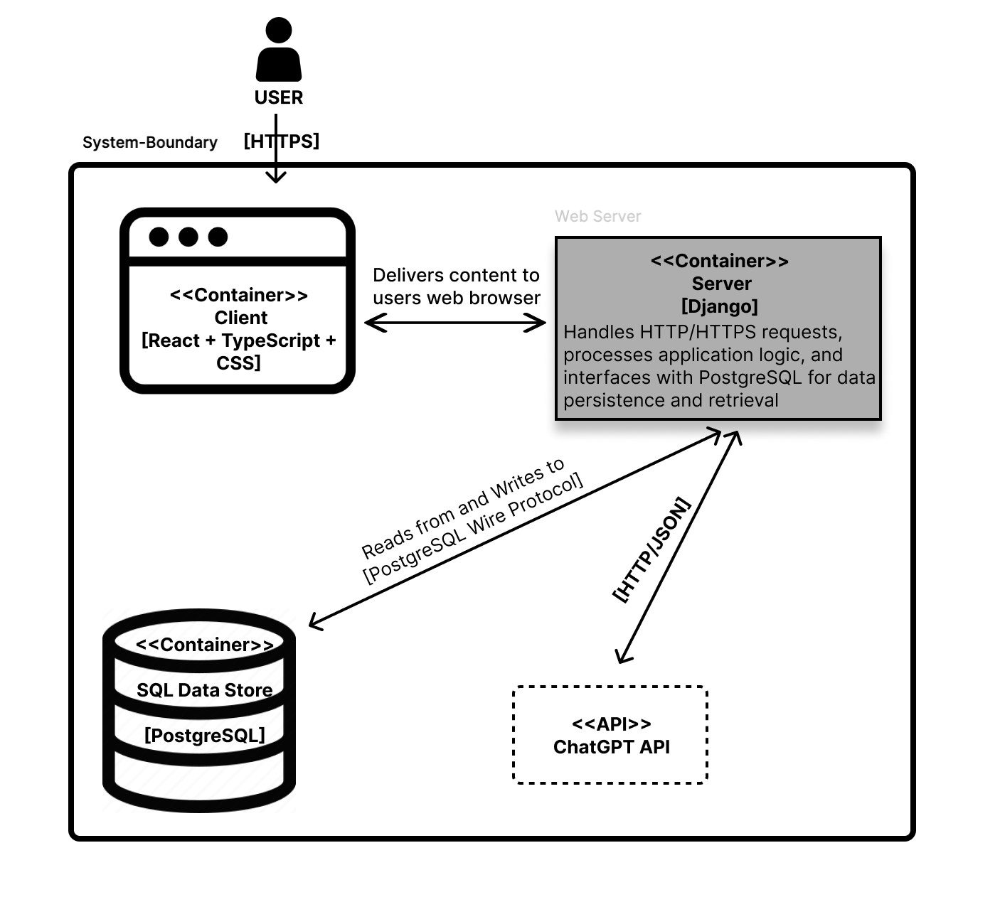
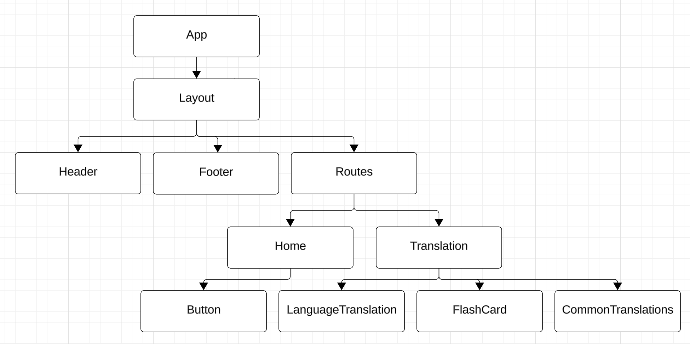

# LingoVerse

## Table of Contents
- [Project Description](#project-description)
- [Tech Stack](#tech-stack)
- [Features](#features)
- [Design](#design)
- [GIF](#screenshots)
- [Run Instructions](#run-instructions)

## Project Description
Arabic dialects differ significantly from Modern Standard Arabic (MSA), which is commonly taught in language learning apps but rarely spoken in daily life. This project aims to develop a translation and learning app focused on Lebanese Arabic, addressing the lack of resources for dialect-specific learning.

## Tech Stack
- **Frontend Development:** React, Typescript, and CSS
- **Backend Development:** Django, and Postman
- **Database:** PostgreSQL 
- **API Integration:** ChatGPT API

## Features
- **Translation Services:** Offer direct translations from Lebanese Arabic to English and vice versa.
- **Interactive Learning Tools:** Implement flashcards, similar to Anki, and other language learning methods to support vocabulary and pronunciation practice.
- **Community Database:** Create a growing collection of translated words and phrases.
- **I18N / L10N:** Convert the Application to arabic using I18N / L10N best practices

## Design
### Container Diagram


### React Component Tree


## GIFS


## Run Instructions
### **Running the React Frontend**

1. Open a new terminal and navigate to the client folder:
   ```bash
   cd client
   ```
2. Start the development server:
   ```bash
   npm run dev
   ```
3. The frontend will be available at:
   ```
   http://localhost:5173
   ```
   
---

### **Running the Django Backend**

1. Open a terminal and navigate to the Django backend folder:
   ```bash
   cd djangoapi
   ```
2. Activate the virtual environment:
     ```bash
     source env/bin/activate
     ```
3. Start the server:
   ```bash
   python manage.py runserver
   ```
4. The backend will be running at:
   ```
   http://localhost:8000
   ```

